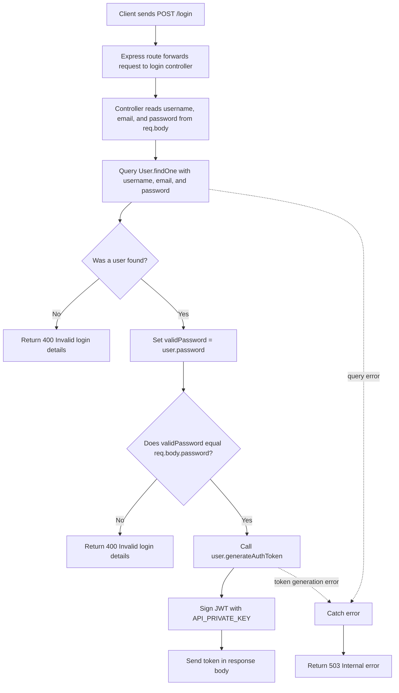

# Login Flowchart

This flowchart reflects the current login logic implemented in `src/routes/auth.js` and `src/controllers/auth.js`.

## Notes

- The route is `POST /login`.
- The current lookup includes `password` in `User.findOne(...)`.
- After the user is found, the controller does a second direct password equality check.
- `bcrypt` is imported, but the active code is not using `bcrypt.compare()` right now.
- The JWT is generated with `process.env.API_PRIVATE_KEY`.
